# 🍔 Food Delivery Management System


A robust, console-based **Food Delivery Application** built using Core Java. This system simulates a complete food ordering ecosystem, providing dedicated interfaces for **Admins**, **Customers**, and **Delivery Agents**. It is built with a strong emphasis on Object-Oriented Programming (OOP) principles, Clean Architecture, and standard Design Patterns.

---

## ✨ Key Features

### 🛡️ Admin Module
- **Menu Management:** Add, update, and toggle the availability of food categories and menu items.
- **User Management:** View registered customers and monitor delivery agents' performance (ratings, total deliveries).
- **Financial Dashboard:** View all system orders, track payment statuses, and calculate total revenue.
- **Dynamic Configurations:** Configure global tax rates, delivery fees, and active discount strategies (Flat, Percentage, or None) on the fly.

### 🍽️ Customer Module
- **Menu Browsing:** View available food items categorized logically.
- **Cart Management:** Add items, update quantities, remove items, and view subtotal.
- **Checkout & Payments:** Place orders using multiple payment strategies (Cash on Delivery, UPI).
- **Order Tracking:** Track ongoing orders in real-time (`CREATED` → `ASSIGNED` → `OUT_FOR_DELIVERY` → `DELIVERED`).
- **Invoicing & History:** View past orders, generate detailed tax invoices, and rate delivery agents.

### 🛵 Delivery Agent Module
- **Profile Management:** View current availability status, average rating, and estimated earnings.
- **Order Fulfillment:** View assigned orders and update statuses to "Out for Delivery" and "Delivered".
- **Auto-Assignment Queue:** The system automatically assigns the next available agent to new orders; if no agents are free, orders are queued and assigned as soon as an agent completes a delivery.

---

## 🛠️ Tech Stack & Design Patterns

| Concern | Technology / Pattern |
|---|---|
| Language | Java 17+ (Core) |
| Build Tool | Apache Maven |
| Data Storage | In-Memory (`HashMap`, `ArrayList`) |
| Discount Logic | **Strategy Pattern** (`FlatDiscount`, `PercentageDiscount`, `NoDiscount`) |
| Payment Logic | **Strategy Pattern** (`CashPayment`, `UPIPayment`) |
| Configuration | **Singleton Pattern** (`SystemConfig`) |
| Data Access | **Repository Pattern** (`InMemoryUserRepository`, `InMemoryOrderRepository`, …) |
| Wiring | **Dependency Injection** via constructors |

---

## 🏗️ System Architecture & Class Diagram

The application follows a layered architecture: **Controllers → Services → Repositories → Models**.

```mermaid
classDiagram

%% ==========================================
%% MODELS
%% ==========================================
    class User {
        <<abstract>>
        #Long id
        #String name
        #String phone
        #String email
        #String password
        +getRole()* Role
        +getId() Long
        +getName() String
        +getPhone() String
        +getEmail() String
        +getPassword() String
    }

    class Admin {
        +getRole() Role
    }

    class Customer {
        -String address
        +getRole() Role
        +getAddress() String
    }

    class DeliveryAgent {
        -boolean available
        -double averageRating
        -int totalRatings
        -int totalDeliveries
        -LocalDateTime lastAssignedTime
        +getRole() Role
        +isAvailable() boolean
        +getRating() double
        +getTotalRatings() int
        +getTotalDeliveries() int
        +addRating(double rating) void
        +incrementDeliveries() void
        +markBusy() void
        +markAvailable() void
    }

    User <|-- Admin
    User <|-- Customer
    User <|-- DeliveryAgent

    class Category {
        -Long id
        -String name
        -boolean active
        +getId() Long
        +getName() String
        +isActive() boolean
        +activate() void
        +deactivate() void
    }

    class MenuItem {
        -Long id
        -String name
        -double price
        -Long categoryId
        -boolean available
        +getId() Long
        +getName() String
        +getPrice() double
        +getCategoryId() Long
        +isAvailable() boolean
        +changeAvailability(boolean status) void
    }

    class Cart {
        -Long customerId
        -List~CartItem~ items
        +clear() void
        +isEmpty() boolean
        +getSubTotal() double
        +getTotalItems() int
    }

    class CartItem {
        -Long menuItemId
        -String menuItemName
        -double priceAtAddTime
        -int quantity
        +getLineTotal() double
    }

    Cart "1" *-- "*" CartItem : contains

    class Order {
        -Long id
        -Long customerId
        -Long deliveryAgentId
        -List~OrderItem~ items
        -double subTotal
        -double discountAmount
        -double deliveryFee
        -double taxAmount
        -double finalAmount
        -OrderStatus status
        -Long paymentId
        -LocalDateTime createdAt
        +getOrderNumber() String
        +assignDeliveryAgent(Long agentId) void
        +markOutForDelivery() void
        +markDelivered() void
        +attachPayment(Long paymentId) void
    }

    class OrderItem {
        -Long menuItemId
        -String menuItemName
        -double priceAtPurchase
        -int quantity
        +getLineTotal() double
    }

    Order "1" *-- "*" OrderItem : contains

    class Payment {
        -Long id
        -Long orderId
        -double amount
        -PaymentMode mode
        -PaymentStatus status
        -LocalDateTime createdAt
        -LocalDateTime paidAt
        +getPaymentId() Long
        +markSuccess() void
        +markFailed() void
    }

%% ==========================================
%% REPOSITORIES
%% ==========================================
    class CategoryRepository {
        <<interface>>
        +save(Category) Category
        +findById(Long) Optional~Category~
        +findAll() List~Category~
        +findAllActive() List~Category~
        +existsByName(String) boolean
    }
    InMemoryCategoryRepository ..|> CategoryRepository

    class MenuItemRepository {
        <<interface>>
        +save(MenuItem) MenuItem
        +findById(Long) Optional~MenuItem~
        +findAll() List~MenuItem~
        +findByCategoryId(Long) List~MenuItem~
        +existsById(Long) boolean
    }
    InMemoryMenuItemRepository ..|> MenuItemRepository

    class OrderRepository {
        <<interface>>
        +save(Order) Order
        +findById(Long) Optional~Order~
        +findAll() List~Order~
        +findOngoingOrders() List~Order~
        +findByCustomerId(Long) List~Order~
        +findByDeliveryAgentId(Long) List~Order~
        +update(Order) void
    }
    InMemoryOrderRepository ..|> OrderRepository

    class PaymentRepository {
        <<interface>>
        +save(Payment) Payment
        +findById(Long) Optional~Payment~
        +findByOrderId(Long) List~Payment~
        +update(Payment) void
    }
    InMemoryPaymentRepository ..|> PaymentRepository

    class UserRepository {
        <<interface>>
        +save(User) User
        +findById(Long) Optional~User~
        +findByEmail(String) Optional~User~
        +findAll() List~User~
    }
    InMemoryUserRepository ..|> UserRepository

    class DeliveryAgentRepository {
        <<interface>>
        +findById(Long) Optional~DeliveryAgent~
        +findAll() List~DeliveryAgent~
        +findAvailableAgents() List~DeliveryAgent~
    }
    DelegatingDeliveryAgentRepository ..|> DeliveryAgentRepository
    InMemoryDeliveryAgentRepository --|> DelegatingDeliveryAgentRepository

%% ==========================================
%% SERVICES
%% ==========================================
    class AuthService { <<interface>> }
    AuthServiceImpl ..|> AuthService

    class CartService { <<interface>> }
    CartServiceImpl ..|> CartService

    class DeliveryService { <<interface>> }
    DeliveryServiceImpl ..|> DeliveryService

    class MenuService { <<interface>> }
    MenuServiceImpl ..|> MenuService

    class OrderService { <<interface>> }
    OrderServiceImpl ..|> OrderService

    class PaymentService { <<interface>> }
    PaymentServiceImpl ..|> PaymentService

    class UserService { <<interface>> }
    UserServiceImpl ..|> UserService

%% ==========================================
%% STRATEGIES
%% ==========================================
    class DiscountStrategy {
        <<interface>>
        +calculateDiscount(Order) double
    }
    FlatDiscount ..|> DiscountStrategy
    NoDiscount ..|> DiscountStrategy
    PercentageDiscount ..|> DiscountStrategy

    class PaymentStrategy {
        <<interface>>
        +pay(double amount) boolean
        +getPaymentType() PaymentMode
    }
    CashPayment ..|> PaymentStrategy
    UPIPayment ..|> PaymentStrategy

%% ==========================================
%% CONFIG & CONTROLLERS
%% ==========================================
    class SystemConfig {
        -SystemConfig instance$
        -DiscountStrategy discountStrategy
        -double taxRate
        -double deliveryFee
        +getInstance()$ SystemConfig
        +initializeSystemDefaults(AuthService) void
    }

    SystemConfig --> DiscountStrategy

    AdminController --> MenuService
    AdminController --> UserService
    AdminController --> OrderService
    AdminController --> PaymentService

    CustomerController --> MenuService
    CustomerController --> CartService
    CustomerController --> OrderService
    CustomerController --> PaymentService
    CustomerController --> DeliveryService

    DeliveryAgentController --> OrderService
    DeliveryAgentController --> DeliveryService

%% ==========================================
%% ENUMS
%% ==========================================
    class Role {
        <<enumeration>>
        ADMIN
        CUSTOMER
        DELIVERY_AGENT
    }

    class OrderStatus {
        <<enumeration>>
        CREATED
        PAID
        ASSIGNED
        OUT_FOR_DELIVERY
        DELIVERED
        CANCELLED
    }

    class PaymentMode {
        <<enumeration>>
        CASH
        UPI
    }

    class PaymentStatus {
        <<enumeration>>
        PENDING
        SUCCESS
        FAILED
    }

    class ErrorType {
        <<enumeration>>
        AUTHENTICATION_ERROR
        CART_ERROR
        ORDER_ERROR
        RESOURCE_NOT_FOUND
        USER_ALREADY_EXISTS
    }
```



---

## 🔐 Default Admin Credentials

A default Admin account is automatically created by `SystemConfig` on the very first boot.

| Field | Value |
|---|---|
| Email | `admin@food.com` |
| Password | `admin123` |

---

## 🚀 Getting Started

### Prerequisites
- Java 17 or higher
- Apache Maven 3.6+

### Build & Run

```bash
# 1. Clone the repository
git clone https://github.com/0xRogueX/food-delivery-app.git
cd food-delivery-app

# 2. Compile the project
mvn compile

# 3. Package into a runnable JAR
mvn package -DskipTests

# 4. Run the application
java -cp target/food-delivery-app-1.0-SNAPSHOT.jar com.com.fooddeliveryapp.Application
```

> **Automated Demo Mode:** Place an `input.txt` file in the working directory before launching.
> The application automatically detects it and reads all menu choices from the file,
> echoing each value to the console. When the file ends, it switches seamlessly to
> interactive keyboard input.

---

## 📋 Automated Demo (`input.txt`)

The repository ships with a ready-to-use `input.txt` that exercises every feature of the application end-to-end.

### What the script covers

| Step | Action | Result |
|------|--------|--------|
| 1 | Register 3 customers (`cus1`, `cus2`, `cus3`) | IDs 2, 3, 4 |
| 2 | Register 2 delivery agents (`agent1`, `agent2`) | IDs 5, 6 |
| 3 | Admin login | `admin@food.com` / `admin123` |
| 4 | Create categories | Burgers (ID 1), Pizzas (ID 2) |
| 5 | Create menu items | Classic Burger ₹150 (ID 1), Cheese Pizza ₹300 (ID 2) |
| 6 | Set 10 % discount for orders ≥ ₹400 | `PercentageDiscount` strategy |
| 7 | `cus1` orders 2× Classic Burger via Cash | ORD-1 → agent1 assigned |
| 8 | `cus2` orders 1× Cheese Pizza via UPI | ORD-2 → agent2 assigned |
| 9 | `cus3` orders 2× Cheese Pizza via Cash | ORD-3 → queued (agents busy) |
| 10 | `agent1` marks ORD-1 Out for Delivery, then Delivered | ORD-3 auto-assigned to agent1 |
| 11 | `cus1` rates agent1 (5.0 ⭐) and views ORD-1 invoice | Invoice shows ₹355.00 |
| 12 | `agent1` views profile | 1 delivery, 5.0 rating, ₹40 earnings |
| 13 | Admin reviews all orders, agents, and finance | Revenue ₹1,320.00 |

### ID Quick Reference

> All IDs in this application are auto-incremented `Long` values. The table below shows
> the IDs assigned during the demo script so you can reuse them in follow-up commands.

| Entity | Name | ID |
|--------|------|----|
| User (Admin) | Admin | 1 |
| User (Customer) | cus1 | 2 |
| User (Customer) | cus2 | 3 |
| User (Customer) | cus3 | 4 |
| User (Agent) | agent1 | 5 |
| User (Agent) | agent2 | 6 |
| Category | Burgers | 1 |
| Category | Pizzas | 2 |
| Menu Item | Classic Burger | 1 |
| Menu Item | Cheese Pizza | 2 |
| Order | ORD-1 (cus1) | 1 |
| Order | ORD-2 (cus2) | 2 |
| Order | ORD-3 (cus3) | 3 |

---

## 📂 Project Structure

```text
src/main/java/com/fooddeliveryapp/
├── config/          # SystemConfig singleton — tax, fees, discount strategy
├── controller/      # Console controllers for Admin, Customer, DeliveryAgent, Auth
├── exception/       # FoodDeliveryException + ErrorType enum
├── model/           # Core entities: User, Customer, DeliveryAgent, Order, Cart, …
├── repository/      # Repository interfaces + InMemory implementations
│   └── inmemory/
├── service/         # Business-logic interfaces
│   └── impl/        # Service implementations
├── strategy/        # DiscountStrategy & PaymentStrategy implementations
├── type/            # Enums: Role, OrderStatus, PaymentMode, PaymentStatus
├── util/            # ConsoleInput, InputUtil, FormatUtil, TablePrinter, AppConstants
├── view/            # InvoiceView — pretty-print tax invoices
└── Application.java # Main entry point & dependency wiring
```

---

## 💡 Order Pricing Formula

```
Final Amount = SubTotal − Discount + (SubTotal × TaxRate%) + DeliveryFee
```

| Parameter | Default Value |
|---|---|
| Tax Rate | 5 % |
| Delivery Fee | ₹40.00 |
| Discount Strategy | None (configurable by Admin) |

---

## 🔮 Future Enhancements

- **Database Integration:** Swap `InMemory*` repositories for JDBC/Hibernate to persist data in PostgreSQL / MySQL (dependency already present in `pom.xml`).
- **REST API:** Expose services via Spring Boot endpoints and pair with a React / Angular frontend.
- **Concurrency:** Implement concurrent order processing for high-throughput simulations.
- **Notifications:** Integrate email or SMS alerts on order status changes.

---

## 📄 License

This project is open-source and available under the [MIT License](LICENSE).
